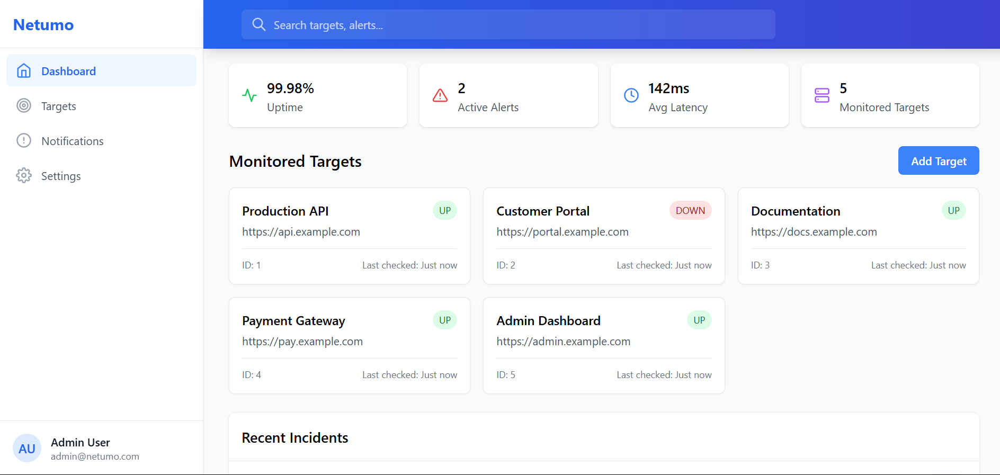

# 🖥️ Mini-Netumo Monitoring System




A production-grade website monitoring solution developed as a capstone project for the University of Dodoma's Application Deployment and Management course.

---

## 📑 Table of Contents

- [🌐 Live Deployment](#-live-deployment)
- [🚀 Features](#-features)
- [🧰 Technical Stack](#-technical-stack)
- [🛠️ Installation](#-installation)
- [📚 API Documentation](#-api-documentation)
- [🏗️ System Architecture](#-system-architecture)
- [🤝 Team Contribution](#-team-contribution)
- [📊 Monitoring Metrics](#-monitoring-metrics)
- [🔒 Security Features](#-security-features)
- [📦 CI/CD Pipeline](#-cicd-pipeline)
- [📝 License](#-license)
- [🙏 Acknowledgments](#-acknowledgments)

---

## 🌐 Live Deployment

- **Frontend**: [https://netumo.seranise.co.tz/](https://netumo.seranise.co.tz/)
- **API Docs**: [Swagger UI](https://netumo.seranise.co.tz/api/)

---

## 🚀 Features

### Core Monitoring

- 5-minute interval HTTP/HTTPS checks
- Status logging with latency tracking
- Uptime/downtime history with visual indicators

### Security Monitoring

- SSL certificate and domain expiry checks
- 14-day alert threshold for expiring certs or domains

### Alert System

- Email notifications via Mailtrap/SES
- Webhook support (Slack, Discord)
- Multi-channel critical alerting

---

## 🧰 Technical Stack

| Component        | Technology                      |
| ---------------- | ------------------------------- |
| Frontend         | React.js + Vite + Tailwind CSS  |
| Backend API      | Node.js + Express               |
| Database         | PostgreSQL + connection pooling |
| Job Queue        | BullMQ + Redis                  |
| Containerization | Docker + Docker Compose         |
| CI/CD            | GitHub Actions                  |
| Hosting          | AWS EC2 (Free Tier)             |

---

## 🛠️ Installation

### Prerequisites

- Docker 20.10+
- Node.js 18+
- PostgreSQL 14+

### Development Setup

```bash
# Clone repository
git clone https://github.com/SE-STUDENTS-GROUP3/mini-netumo-app.git
cd mini-netumo-app

# Install dependencies
npm install

# Copy environment variables
cp .env.example .env

# Start development containers
docker-compose -f docker-compose.dev.yml up -d
```

### Production Deployment

```bash
docker-compose up -d --build
```

---

## 📚 API Documentation

The API follows RESTful conventions with JWT-based authentication.

- **Interactive Docs**: [Swagger UI](https://netumo.seranise.co.tz/api/)
- **OpenAPI Spec**: `/api/openapi.json`

---

## 🏗️ System Architecture


### Components

1. **Load Balancer**: Nginx reverse proxy
2. **Frontend**: React.js (2–3 instances)
3. **API Service**: Express.js application
4. **Worker**: Monitoring job processor
5. **Database**: PostgreSQL with daily backups
6. **Redis**: Job queue and caching system

---

## 🤝 Team Contribution

| Name            | Role               | Key Contributions               |
| --------------- | ------------------ | ------------------------------- |
| Godfrey Mcharo  | Backend Lead       | API development, JWT auth       |
| Layson Ndenza   | Frontend Lead      | Dashboard UI, chart integration |
| David Masao     | DevOps Engineer    | Docker setup, CI/CD pipeline    |
| Kulwa Borniface | QA Engineer        | Testing, monitoring logic       |
| Felister Kapaya | Documentation Lead | API docs, system documentation  |

---

## 📊 Monitoring Metrics

Metrics include:

- Response time per request
- Uptime/downtime duration
- SSL and domain expiration status

---

## 🔒 Security Features

- JWT authentication + refresh tokens
- Role-based access control (RBAC)
- Rate-limited API endpoints
- Environment-based secret management
- Automated secret rotation

---

## 📦 CI/CD Pipeline

- Continuous integration via GitHub Actions
- Automated container builds and deployment

---

## 📝 License

This project is licensed under the MIT License. See the [LICENSE](https://license/) file for details.

---

## 🙏 Acknowledgments

- **Dr. Goodiel Moshi** – Project Supervisor
- **Netumo** – Project inspiration
- **University of Dodoma – CIVE Faculty**

---
